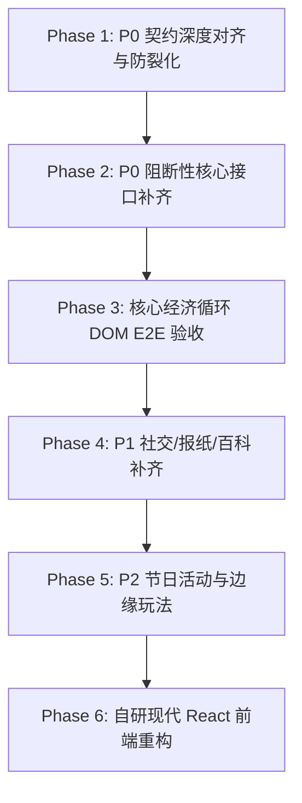

# Phantom Backend Compatibility & P0 Core Economic Loop Roadmap

## 1. 核心战略目标 (Core Strategic Objective)
> **“在启动前端重构前，基于官方前端客户端的真实契约，将 Phantom 后端推到 100% Contract-Verified & E2E-Verified。”**
>
> 避免“前端业务”与“后端契约”双重不确定性。以官方前端（`frontend-original/static/bundle/assets/index-cgzgptQ8.js`）为唯一验收标准，确保核心经济循环（建筑、生产、仓储、交易、合同、政府订单、财务结算）无缝闭环、状态持久化零漏洞。

---

## 2. API 现状基线 (Baseline Assessment)
- **官方前端提取端点数**：594（含 297 个多语言镜像）。
- **剔除无用外部系统**（Courses 培训 11 个、Steam/三方支付 10 个、运营埋点 14 个、三方 AI 3 个、验证码 2 个、官方审计与风控后台 27 个）后：
  - **玩家侧实际基数**：**230 个核心接口**。
  - **当前已实现**：**156 个 (67.8%)**。
  - **微小版本差异**：**2 个 (0.9%)**（报纸赞助商 `/v2/` vs `/v3/`，百科质量 `/v4/` vs `/v2/`）。
  - **待补齐接口**：**72 个 (31.3%)**。

---

## 3. 阶段分级规划 (Phased Implementation Roadmap)

### Phase 1: P0 已有核心接口的“深度契约对齐” (Contract Alignment)
> **目的**：将当前 156 个“Route 已存在”升级为“Method + Request + Response Schema + Side-effects 100% 官方一致”。

- [ ] **建筑建造与管理** (`/api/v2/companies/buildings/`)
  - 检查建造响应是否严格包含 `cost`, `resourcesConsumed`, `building`。
  - 确保升级 (`PATCH size: 1`) 正确返回扣减原料 `resourcesConsumed` 与更新后的管理费用 `user.administrationOverheadPlusOne`。
  - 确保降级/拆除 (`size: -1` / `DELETE`) 正确返还折旧资金 `money` 与废料 `resources`。
- [ ] **生产与排产队列** (`/api/v2/companies/buildings/:id/queue/`)
  - 检查排产 `POST` 响应是否返回完整最新队列数组，原料扣减原子性落库。
  - 检查取消生产 `DELETE` 响应是否立即刷新队列。
- [ ] **交易所挂单与撮合** (`/api/v2/market/order/`, `/api/market/`)
  - 挂单 `POST` 响应必须包含 `moneyDelta`（扣除挂单手续费）和扣减运输单元（`Pe.TRANSPORTATION`）。
  - 撤单 `DELETE` 响应必须包含 `fees`。
  - 订单簿 `GET` 必须附带 `x-timestamp` 与 `x-request-ip` 响应头。
- [ ] **销售办公室交付** (`/api/v2/companies/buildings/:id/sales-orders/:id/`)
  - `PUT lowestQualityFirst: boolean` 严格返回 `{ money, resourceTransactions }` 并持久化货款。

---

### Phase 2: P0 阻断性核心接口补齐 (Critical Gap Filling)
> **目的**：集中攻坚剩余 72 个未实现接口中真正影响主游玩的 12 个关键 P0 接口。

1. **财务与报表闭环**：
   - `GET /api/v2/companies/:id/balance-sheet/`（资产负债表，防止财务总览白屏）
   - `GET /api/v2/companies/:id/cashflow-statement/`（现金流量表）
   - `GET /api/v2/companies/:id/income-statement/`（利润表）
   - `GET /api/v2/companies/me/administration-overhead/`（管理费用率实时查询）
2. **直销合同扩展**：
   - `GET /api/v2/contracts-history/:id/`（直销合同历史明细）
3. **小秘书 / 私人助理 (PA)**：
   - `POST /api/v2/pa-action/:id/:action/`（小助理引导任务完成与奖励领取）
4. **公司基本状态与核验**：
   - `GET /api/v2/company-lookup/:realmId/:name/:tag/`（公司防重名与信息检索）
   - `POST /api/v2/players/simboosts-use/:action/`（SimBoosts 加速与核心槽位解锁）

---

### Phase 3: 全链路闭环 DOM E2E 验证 (End-to-End Verification)
> **目的**：拒绝单接口单元测试的自嗨，完全基于真实 Chromium 驱动官方前端。

- [ ] 新建企业账号从 0 启动。
- [ ] 建造种植园 / 发电厂，消耗金钱与建材。
- [ ] 启动排产生产水 / 苹果，原料正确减少，生产完成后入库。
- [ ] 将产物挂牌至交易所，消耗运输机与手续费。
- [ ] 另一测试账号吃单成交，货款入账，库存转移。
- [ ] 销售办公室接单并交付订单，货款到账。
- [ ] 检查财务资产负债表与现金流明细，各项数据平衡。
- [ ] 页面全量刷新，确认所有数据库状态持久化一致。

---

### Phase 4 & 5: P1 拓展与 P2 活动系统（后续收尾）
- **Phase 4 (P1 体验完整度)**：
  - 官方报纸历史文章订阅与投票 (`/api/v2/newspaper/`)
  - 百科全书行业进阶分析 (`/api/v3/encyclopedia/`)
  - 聊天置顶与聊天规则展示 (`/api/v2/chatentry/`)
- **Phase 5 (P2 节日边缘玩法)**：
  - 复活节彩蛋收集与交换 (`/api/v2/egg-collect/`)
  - 火箭发射统计与特殊节日徽章

---

### Phase 6: 自有前端现代 React 重建 (Frontend Rebuild)
- 当 Phase 1~3 全部完成，后端核心经济循环达到 100% 坚固度时，启动轻量级现代化 React + TypeScript 前端重构，仅对接已验证的规范 API。
