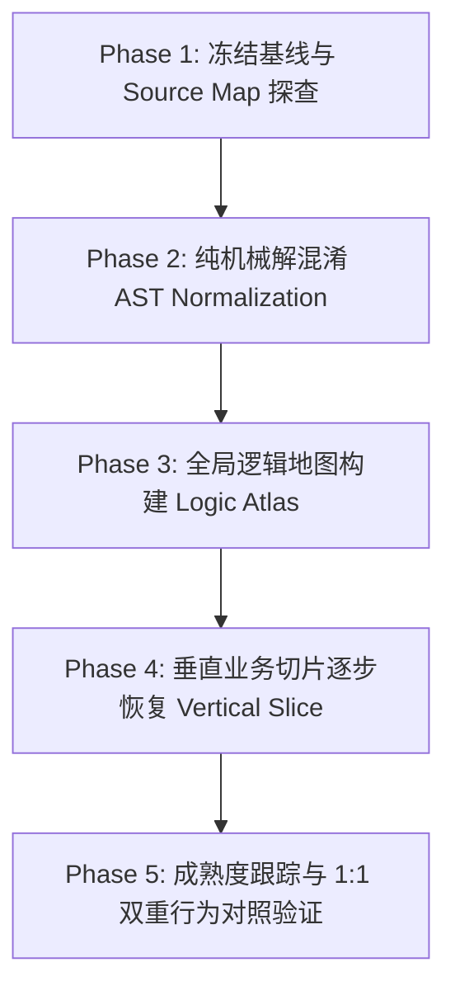

# SimCompanies 逆向工程与前端 1:1 语义恢复工程规划 (Master Roadmap)

> **工程最高总则**：
> **把现有 production 网页当成唯一真理，逐步逆向剥离混淆，还原为 1:1 的可维护规范源码。**
> 坚决禁止“凭空重新写一个功能类似的游戏”，严禁脱离官方 6.8MB Bundle（`frontend-original/static/bundle/assets/index-cgzgptQ8.js`）脑补 UI 或业务逻辑。
> 每一个恢复出来的模块，必须保留原版 DOM 结构、CSS 类名、交互时序、路由跳转、API 契约、Redux 状态机，并具备可追溯的 Provenance 证据。

---

## 1. 核心战略流水线：五阶段递进 (5-Stage Engineering Pipeline)



### Phase 1: 冻结基线与 Source Map 探查 (Baseline Freeze & Source Map Audit)
* **目标**：将 `frontend-original/` 设为不可变基线；探查是否存在 `.js.map`。
* **交付物**：
  * `reconstruction-report/source-map-audit.json`
* **判断门禁 (Gate)**：
  * 若存在 `.map`：直接利用 Source Map 提取原汁原味的源码树；
  * 若无 `.map`：正式进入基于 AST 与 Logic Atlas 的逆向流水线。

### Phase 2: 纯机械解混淆 (AST Mechanical Normalization)
* **目标**：在**完全不改变任何业务逻辑、不修改任何业务变量名**的前提下，消除单行压缩与紧凑混淆。
* **规则**：
  * 展开逗号表达式（`a(), b(), c()` $\rightarrow$ 独立分行语句）
  * 展开三元与短路运算（`a || b()` $\rightarrow$ `if (!a) { b(); }`）
  * 展开对象解构别名
* **交付物**：
  * `reconstruction-work/normalized/index.normalized.js`
* **判断门禁 (Gate)**：
  * **必须保持可运行**：在浏览器中加载 `index.normalized.js`，控制台无报错，路由与基础交互正常。

### Phase 3: 全局逻辑地图构建 (Logic Atlas Construction)
* **目标**：在不盲目重写组件的前提下，先回答：“这个 6.8MB 的包里到底有什么？”
* **核心资产建立（`reconstruction-report/atlas/`）**：
  * `routes.json`：提取全量客户端路由与对应组件符号（`/buildings`, `/warehouse`, `/market` 等）
  * `api-callers.json`：将 594 个已知 API 路由与前端实际调用函数关联
  * `components.json`：提取所有 React 组件（Class / Function）、对应 Props 及 DOM 结构特征
  * `state.json`：梳理 Redux Store 的 22 个 Slice Reducer、Action Types 与 Initial State
  * `dependency-graph.json`：全局调用关系与数据流图谱

### Phase 4: 按“垂直切片”恢复源码 (Vertical Slice Reconstruction)
* **目标**：坚决拒绝按代码行数盲目翻译，而是按**功能垂直切片**逐一攻坚。
* **恢复实施序列**：
  1. **底层骨架**：`router.ts`（路由分发骨架）与 `httpClient.ts`（HTTP 客户端与拦截器）
  2. **会话与外壳**：`auth/` 与 `layout/`（公司信息栏、导航顶栏、通用模态框）
  3. **核心页面 1：仓库与库存**（`warehouse/`：151 种资源、直签合同接发、买单）
  4. **核心页面 2：建筑与地皮**（`buildings/`：建造、升级、降级、拆除、机器人配置）
  5. **核心页面 3：生产排产**（`production/`：排产队列、时间计算、原料扣除）
  6. **核心页面 4：零售与餐饮**（`retail/`：零售时钟、二次价格惩罚、餐厅评分与翻台率）
  7. **核心页面 5：交易所与吃单**（`market/`：订单簿挂牌、吃单撮合、运输费用）
  8. **核心页面 6：公司财务与债券**（`finance/`：资产负债表、每日利息、发债与赎回）
  9. **核心页面 7：总部与高管 HR**（`executives/`：聘用、培训、C-Suite 任命、边际递减）
* **每个切片标准产出**：
  * `reconstruction/<slice>/provenance.json`
  * `reconstruction/<slice>/api.ts`
  * `reconstruction/<slice>/selectors.ts`
  * `reconstruction/<slice>/<Page>.tsx`

### Phase 5: 三重验收门与成熟度跟踪 (Verification Gates & Maturity)
* **成熟度体系 (L0 ~ L7)**：
  * **L0 Unknown** $\rightarrow$ **L1 Located** $\rightarrow$ **L2 Identified** $\rightarrow$ **L3 Renamed** $\rightarrow$ **L4 Extracted** $\rightarrow$ **L5 Static-Verified** $\rightarrow$ **L6 Behaviour-Verified** $\rightarrow$ **L7 1:1 Verified**
* **L7 硬门禁**：
  1. **P — Provenance**：原始 SHA、Bundle 范围、符号与证据全部可机器验证。
  2. **S — Semantic**：AST/结构指纹证明调用、条件、集合操作、返回和 dispatch 顺序没有漂移。
  3. **B — Behaviour**：独立 `VERIFY_ONLY` 浏览器对比 DOM、Network、State、Console 和 Screenshot。
* `SYNTHETIC_BUSINESS` 或 `UNKNOWN` 任一非零，切片必须拒绝。

---

## 2. 工程目录结构规范

```text
phantom-backend-7x/
├── frontend-original/                 # [只读/不可变] 官方生产环境原始快照
│   ├── index.html
│   ├── static/
│   │   ├── bundle/assets/index-cgzgptQ8.js
│   │   └── bundle/assets/index-BsDbFrGK.css
│   └── images/
│
├── reconstruction-work/               # [工作区] 机械解构与规范化中间产物
│   ├── raw/
│   ├── normalized/
│   │   └── index.normalized.js        # 语法展开但保留原语义的可运行 Bundle
│   └── analysis/                      # AST 提取出的中间分析数据
│
├── reconstruction-report/             # [分析与证据库]
│   ├── source-map-audit.json          # Source Map 探查报告
│   ├── symbol-ledger.json             # 符号推导置信度账本 (带证据链)
│   └── atlas/                         # Logic Atlas 全景地图
│       ├── routes.json
│       ├── api-callers.json
│       ├── components.json
│       ├── state.json
│       └── dependency-graph.json
│
├── reconstruction/                    # [最终目标] 1:1 语义还原出的现代化规范 TypeScript/React 源码
│   ├── router/
│   ├── api/
│   ├── selectors/
│   └── components/
│
└── RECONSTRUCTION_RULES.md            # 10 条不可逾越的重构铁律
```

---

## 3. 当前 Sprint 核心冲刺目标 (Sprint Deliverables)

1. [x] **既有阶段确认**：Source Map 探查与机械去混淆/多语言解释已经完成，不重复执行。
2. [x] **恢复原始基线**：清除对生产 Bundle 的历史插桩，冻结 `frontend-original/` SHA-256。
3. [ ] **建立自动约束**：完成 Provenance、Semantic、Classification、Behaviour 三重验收脚本及负向测试。
4. [ ] **全景地图结构化**：只将现有 594 API、1026 路由、Redux、组件研究证据转换为 Atlas；不得脑补缺失关系。
5. [ ] **基础设施恢复**：从原始 Bundle 精确提取 Router 与 HTTP Client；静态三门通过后才进入浏览器验证。
6. [ ] **首个垂直切片**：从 Warehouse 开始，恢复原 DOM/API/State/CSS 链并达到 L7。
