# SimCompanies Private Server (phantom-backend-7x)
## 后端系统架构、核心状态机与全景设计文档 (Backend System Architecture & Design)

---

## 一、纯后端及测试代码体量统计 (Backend-Only Statistics)

> **统计口径说明**：本统计**严格剔除** `frontend-original/` 前端打包资源与临时目录，仅统计纯后端 Node/TypeScript 源码、核心游戏领域库、业务用例、数据层及自动化测试套件。

```
==========================================================================================
                    PHANTOM-BACKEND-7X BACKEND METRICS
==========================================================================================
 📦 后端+测试源码总行数 (Total Source Lines) : 58,869 行
 📁 后端+测试源码文件数 (Total Source Files) : 279 个 (.ts / .mjs / .sh)
 🗄️ SQLite 实体表 (Database Tables)          : 41 张核心业务表 (含完整索引与外键)
 🌐 API 路由模块 (HTTP Route Handlers)       : 23 个文件 (覆盖 180+ REST / Compatibility Endpoints)
 ⚙️ 业务用例 (Application Use Cases)         : 18 个独立业务用例
 🎮 核心游戏领域模块 (Game Domain Logic)     : 27 个领域子系统 (10,880 行纯业务与经济规则)
 🧪 自动化测试套件 (Test Suites)              : 118 个测试文件 (24,294 行自动化测试)
==========================================================================================
```

### 纯后端与测试目录分布明细
| 模块目录 | 源码文件数 | 代码行数 | 核心架构职责 |
|---|:---:|:---:|---|
| `server/game/` | 27 | 10,880 | 核心经济与领域规则（市场撮合、等级经验、税费、生产计算、餐厅模型等） |
| `server/routes/` | 23 | 6,935 | HTTP 请求解析、鉴权上下文校验、兼容层 DTO 拼装输出 |
| `server/application/` | 18 | 1,574 | 业务用例层（生产启停/收取、建筑建造/升级、事务边界管控） |
| `server/core & adapters` | 20 | 1,905 | 路由注册中心、会话管理、领域事件总线、WebSocket 广播服务 |
| `server/db/` | 5 | 1,140 | SQLite 连接池、分层 Migration、初始 Seed、原子事务管理器 |
| `server/repositories/` | 4 | 884 | 领域仓库（纯数据持久化，与前端 DTO 完全解耦） |
| `server/scheduler/` | 2 | 858 | UTC 每日定时引擎（利息结算、薪资扣除、GO 重置、市场饱和度计算） |
| `server/domain/` | 4 | 769 | 纯领域规则与不变量（等级阶梯、研究树、Realm 规则集） |
| `tests/` | 118 | 24,294 | 包含单元测试、API 契约测试、回归门禁、Playwright 真实浏览器用户旅程 |
| `scripts/` | 20 | 2,791 | 持续集成测试分层门禁、浏览器发现、诊断与运维工具 |
| `root & config` | 38 | 6,839 | 配置文件、README、工作流与项目元数据 |

---

## 二、Storyboard（端到端玩家交互全景故事板）

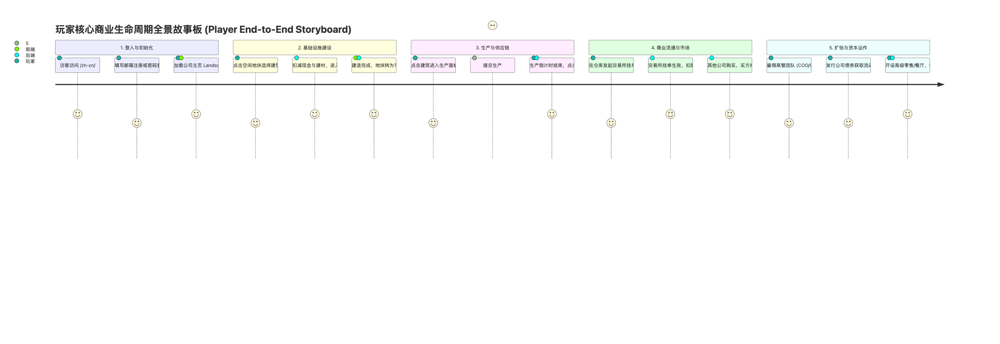

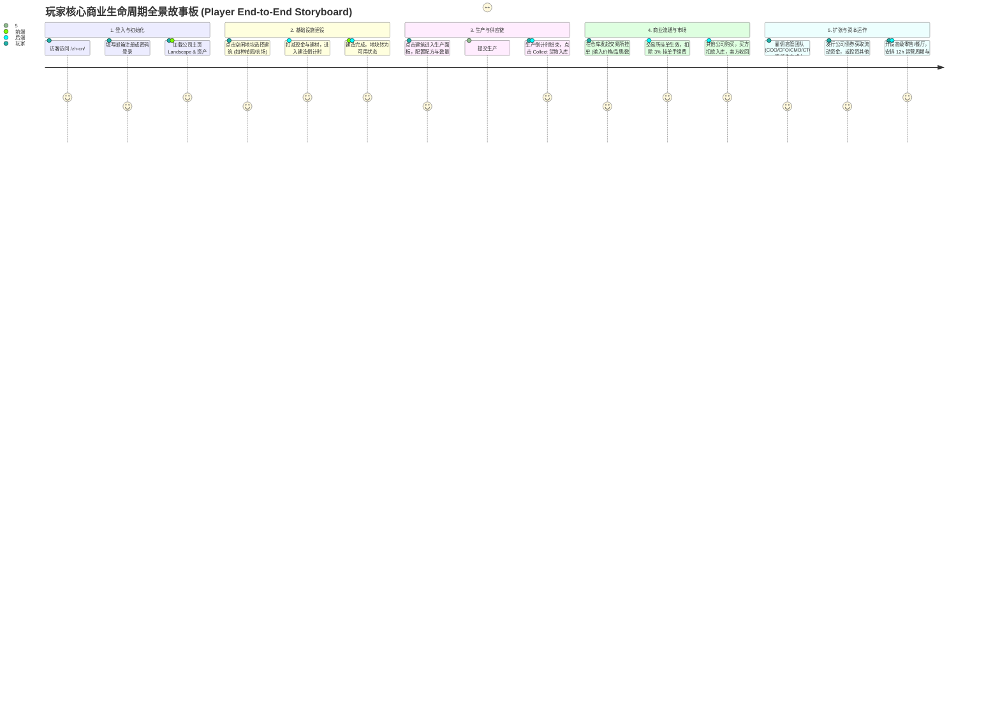

---

## 三、IPO Chart（核心高频业务系统的输入-处理-输出精要）

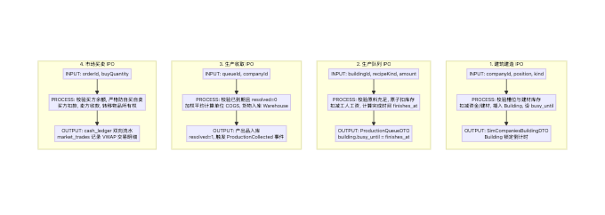

```mermaid
flowchart TD
    subgraph Construction_IPO [1. 建筑建造 IPO]
        In1["INPUT: companyId, position, kind"] --> Proc1["PROCESS: 校验槽位与建材库存<br/>扣减资金/建材, 插入 Building, 设 busy_until"]
        Proc1 --> Out1["OUTPUT: SimCompaniesBuildingDTO<br/>Building 锁定倒计时"]
    end

    subgraph Production_IPO [2. 生产队列 IPO]
        In2["INPUT: buildingId, recipeKind, amount"] --> Proc2["PROCESS: 校验原料充足, 原子扣库存<br/>扣减工人工资, 计算完成时间 finishes_at"]
        Proc2 --> Out2["OUTPUT: ProductionQueueDTO<br/>building.busy_until = finishes_at"]
    end

    subgraph Collect_IPO [3. 生产收取 IPO]
        In3["INPUT: queueId, companyId"] --> Proc3["PROCESS: 校验已到期且 resolved=0<br/>加权平均计算单位 COGS, 货物入库 Warehouse"]
        Proc3 --> Out3["OUTPUT: 产出品入库<br/>resolved=1, 触发 ProductionCollected 事件"]
    end

    subgraph Market_IPO [4. 市场买卖 IPO]
        In4["INPUT: orderId, buyQuantity"] --> Proc4["PROCESS: 校验买方余额, 严格防自买自卖<br/>买方扣款, 卖方收款, 转移物品所有权"]
        Proc4 --> Out4["OUTPUT: cash_ledger 双向流水<br/>market_trades 记录 VWAP 交易明细"]
    end
```

| 业务系统 | INPUT (输入) | PROCESS (核心业务处理与不变量约束) | OUTPUT (输出与状态变化) |
|---|---|---|---|
| **1. 建造建筑** | `companyId`, `position`, `kind` | • 校验地块空闲与槽位限制<br>• 校验建材库存充足<br>• 开启 DB Transaction 扣减现金与建材 | • `buildings` 新增记录<br>• 建筑置为 `busy_until`<br>• 返回 `SimCompaniesBuildingDTO` |
| **2. 开始生产** | `buildingId`, `recipeKind`, `amount`, `quality` | • 校验建筑空闲 (`busy_until <= now`)<br>• 校验原料库存，原子扣减 Warehouse<br>• 计算工时与工人工资 | • `production_queues` 插入记录<br>• `building.busy_until = finishes_at`<br>• 返回 `ProductionQueueDTO` |
| **3. 生产收取** | `queueId`, `companyId` | • 校验 `resolved = 0` 且到期<br>• 校验建筑归属<br>• 计算单位加权成本 (COGS) 入库 | • `resolved = 1`，清除 `busy_until`<br>• Warehouse 增加产出品<br>• 触发 `ProductionCollectedEvent` |
| **4. 市场挂单** | `resourceKind`, `quantity`, `price`, `quality` | • 校验品质 (Q0~Q12) 与合理限价<br>• 扣除 3% 挂单手续费<br>• 货物移入托管 (Escrow) | • Warehouse 扣减货物<br>• `market_orders` 插入 `active = 1`<br>• 返回 `MarketOrderDTO` |
| **5. 市场吃单** | `orderId`, `buyQuantity` | • 校验买方现金余额充足<br>• 严格防自买自卖<br>• 双边资金转移与库存加权划转 | • 买方扣款入库，卖方收款<br>• 更新挂单 `active` 状态<br>• 写入 `cash_ledger` 与 `market_trades` |
| **6. 餐厅周期运作** | `buildingId`, `menuItems[]`, `seats`, `price` | • 校验 12 小时锁定周期<br>• 综合计算 rating、定价、服务员与客流量<br>• 计算食材消耗与损耗 | • 更新 `restaurant_runs`<br>• 结算利润并调整星级评级 |

---

## 四、核心图表 1：Class Diagram（领域对象与分层类图）

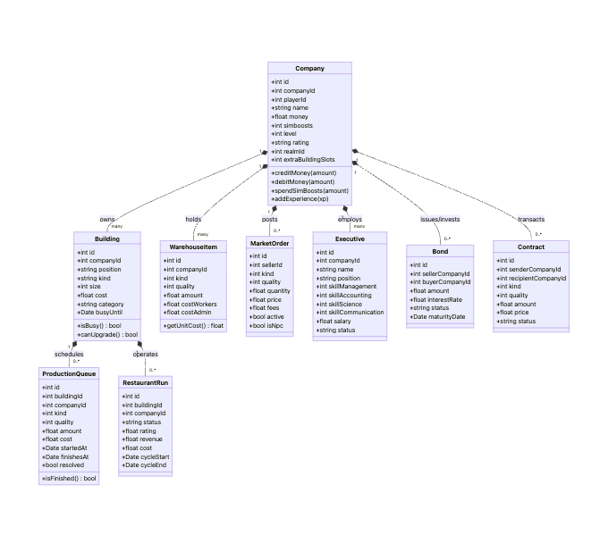

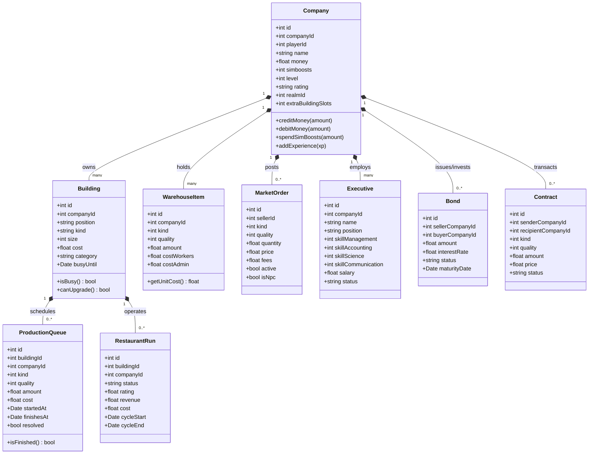

---

## 五、核心图表 2：State Diagram（四大核心业务状态机）

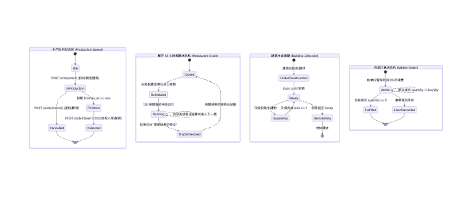

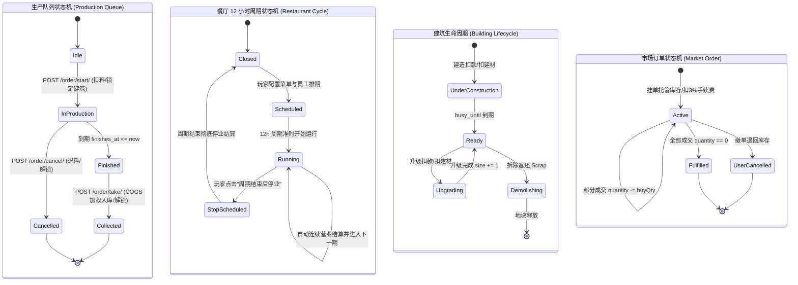

---

## 六、核心图表 3：Sequence Diagram（玩家操作端到端调用时序）

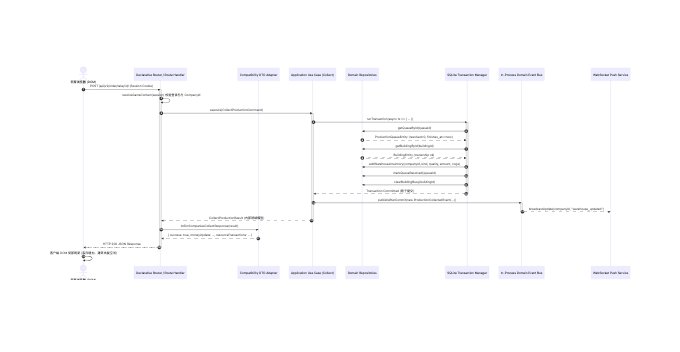

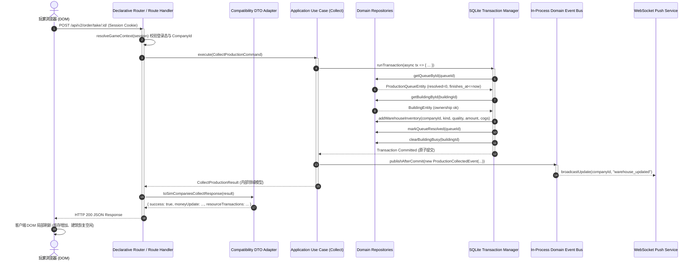

---

## 七、核心图表 4：ERD（数据库实体关系与外键拓扑）

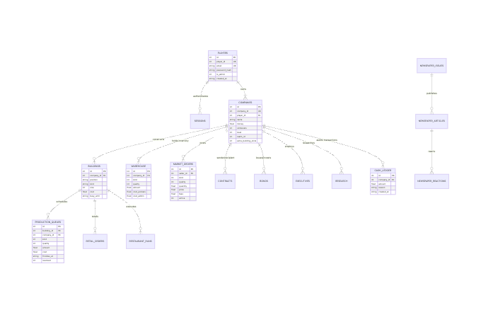

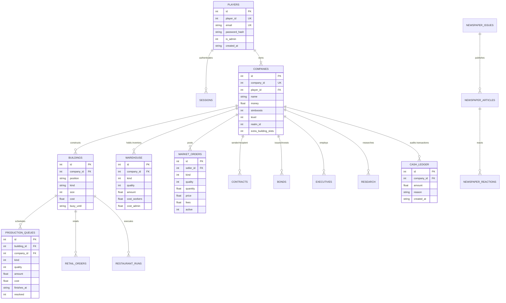

---

## 八、核心图表 5：DFD（跨模块资金、库存与事件数据流图）

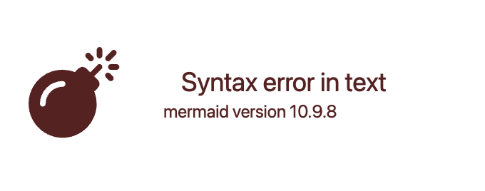

```mermaid
flowchart TD
    subgraph Market_Trading_Context [市场交易数据流图]
        Buyer[买方公司 (Buyer)] -->|1. 提交买单请求 POST /api/v2/market/buy/| Route[Market Route Handler]
        Route -->|2. 校验资金与订单状态| OrderEngine[Market Matching Engine]
        
        OrderEngine -->|3. 开启原子事务| TX[SQLite DB Transaction]
        
        TX -->|4. 扣减买方现金| CashDebit[Cash: Debit Buyer]
        TX -->|5. 增加卖方现金| CashCredit[Cash: Credit Seller]
        TX -->|6. 划转物品所有权| InventoryTransfer[Warehouse: Transfer Qty & Update COGS]
        TX -->|7. 更新挂单状态| OrderUpdate[MarketOrders: Set active / update qty]
        TX -->|8. 记录 VWAP 交易明细| TradeLedger[MarketTrades Ledger]
        
        CashDebit --> RecordLedger[Cash Ledger: 记录双边审计账本]
        CashCredit --> RecordLedger
        
        TX -->|9. Transaction Commit| Committed[事务成功提交]
    end

    subgraph After_Commit_Side_Effects [事务后异步副作用]
        Committed -->|10. Emit Typed Event| EventBus[Domain Event Bus: MarketTradeCompleted]
        EventBus -->|11. 检查交易成就| AchProg[Achievement Progress Updater]
        EventBus -->|12. 刷新实时行情| VWAPService[VWAP Price & Tick Tracker]
        EventBus -->|13. 消息通知| NotifyService[Chat / Notification Service]
        EventBus -->|14. 广播客户端| WS[WebSocket Push: Balance & Warehouse Delta]
    end
```
