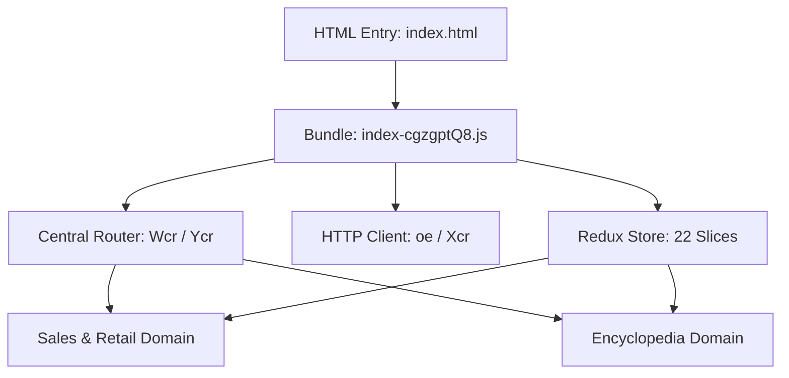

# SimCompanies Frontend Bundle Semantic Architecture

## 1. 架构总览 (System Overview)

SimCompanies 生产环境客户端（`frontend-original/static/bundle/assets/index-cgzgptQ8.js`，约 6.5MB）采用基于 Vite / Rollup 打包的 Single Page Application (SPA) 架构。



## 2. 状态管理分层 (Redux Architecture)

Redux Store 由入口初始化函数（`gur`）配置，并通过 `combineReducers`（`$kt`）挂载了 22 个核心业务切片（`Xia`）：

1. **`buildings` (Reducer: `Rdr`)**: 管理玩家名下所有建筑实例（`buildings` 字典）、生产/零售排产队列（`queues`）、富矿度（`abundance`）与休闲建筑加成（`recreationBonus`）。
2. **`constants` (Reducer: `tBr`)**: 固化并缓存静态资源与零售市场动态。包含全量资源定义、各分服零售市场饱和度字典（`resourceRetail[realmId]`）、以及资源深度说明（`resourceDetails`）。
3. **`market` (Reducer: `Nia`)**: 维持全局交易所行情（`ticker`）与撮合深度订单簿。
4. **`user` (Reducer: `GOr`)**: 玩家金钱、SimBoosts、管理开销率（`administrationOverhead`）、生产及销售加成（`salesModifier`）。
5. **`warehouse` (Reducer: `ccr`)**: 玩家库存物料与流水记录（`resourceTransactions`）。
6. **`hints` (Reducer: `Yin`)**: 新手教程引导与百科全书已知标记（`encyclopediaAcknowledged`）。

## 3. 网络与请求层 (HTTP Infrastructure)

* **客户端实例提供者**: `oe()` 单例返回封装后的 Axios / Fetch 请求器。
* **请求头构造器 (`Xcr` / `kBe`)**:
  * `X-CSRFToken`: 从 Cookie 自动提取并注入。
  * `X-tz-offset`: 自动注入客户端时区偏移分钟数。
  * `X-Yep`: 官方防抓包握手标志（`true`）。
  * `X-Ts` / `X-Prot`: 关键高频接口附加的动态时间戳防脚本签名。

## 4. 语义恢复目录结构 (Restored Tree)

```text
restored/
├── features/
│   ├── sales/
│   │   ├── GenericRetailBuilding.tsx   # 零售大楼通用共享组件（杂货、电子、加油站等）
│   │   ├── SalesOfficeBuilding.tsx     # 销售办公室专属组件（航空合同交付）
│   │   ├── RestaurantBuilding.tsx      # 餐厅专属组件（菜单、座位、员工评级）
│   │   ├── SalesBuildingPage.tsx       # 销售建筑总控分发入口
│   │   ├── useSalesBuilding.ts         # 销售业务数据与操作 Hook
│   │   └── types.ts                    # 局部状态与领域类型
│   └── encyclopedia/
│       ├── EncyclopediaPage.tsx        # 百科全书导航检索大厅
│       ├── EncyclopediaCategoryList.tsx# 10 大产业门类筛选
│       ├── EncyclopediaResourceDetail.tsx # 资源配方与单件经济测算
│       ├── EncyclopediaBuildingDetail.tsx # 建筑产线与用工成本明细
│       ├── useEncyclopedia.ts          # 百科数据流与成本核算 Hook
│       └── types.ts                    # 百科状态与核算结构类型
├── api/
│   ├── http-client.ts                  # 严谨契约 HTTP 客户端
│   ├── sales-api.ts                    # 零售、合同、餐饮专属 API 服务
│   └── encyclopedia-api.ts             # 饱和度、行情、阶梯品质 API 服务
├── store/
│   └── root-reducer.ts                 # 22 切片 Redux 根状态映射表
├── shared/
│   ├── game-constants.ts               # 基准工资 345、建筑代码与品类枚举
│   └── types.ts                        # 建筑、物料、排产、合同全量接口
└── routes/
    └── route-definitions.ts            # 从 Wcr 提取的 100% 强类型双端路由表
```
