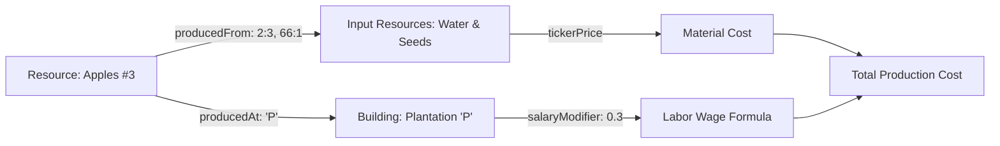

# SimCompanies Encyclopedia Semantic Analysis Report

本报告系统性回答关于 SimCompanies 百科全书（Encyclopedia）的 10 项核心问题。

---

### 1. Encyclopedia 的 route 是什么？
官方客户端注册了成套的层次化路由（从 `Wcr` 提取）：
* **基准大厅入口**：`/encyclopedia/${realm}/`
* **资源分类大厅**：`/encyclopedia/${realm}/resources/`
* **资源单品详情**：`/encyclopedia/${realm}/resource/${resourceId}/`
* **建筑全量列表**：`/encyclopedia/${realm}/buildings/`
* **建筑单品详情**：`/encyclopedia/${realm}/building/${buildingKind}/`
* **季节活动曲线**：`/encyclopedia/${realm}/seasons/`、`/retail-seasons/${season}/`、`/production-seasons/${season}/`
* **排行榜与评级**：`/encyclopedia/${realm}/ranking/`、`/eva-ranking/`、`/ratings/`、`/levels/`

---

### 2. 页面入口 module 是什么？
* **代码区域**：`index-cgzgptQ8.js` 偏移 `4068000` 至 `4085000`。
* **分发入口**：`EncyclopediaContainer`（绑定 Redux `mapStateToProps` 与 `mapDispatchToProps`）。
* **挂载动作**：组件装载（`componentDidMount`）时触发：
  * `fetchResourceRetail(realmId)`
  * `fetchTicker(realmId)`
  * `fetchAdministrationOverhead()`
  * `acknowledgeEncyclopedia()`（消除新手指引气泡提示）

---

### 3. 主要 components 是什么？
1. **`EncyclopediaPage` (Portal)**：主入口框架，包含顶部搜索栏与工业门类导航。
2. **`EncyclopediaCategoryList`**：10 大行业大类（农业、食品、建筑、时尚、能源、电子、汽车、航空、材料、科技）网格。
3. **`EncyclopediaResourceDetail`**：物料核心卡片，呈现时产公式、配方原料（BOM）、单件成本拆解（原料+工人工资+行政分摊）、以及市场参考售价。
4. **`EncyclopediaBuildingDetail`**：建筑详情卡片，呈现建造成本单位、工资倍率、升级阶梯阈值（Tiers）以及生产物料/零售商品目录。

---

### 4. 数据来源是什么？与 5. 是否存在独立 Encyclopedia API？
**结论：不存在单一且独立的“百科全书后端服务 API”！**

百科全书是一个典型的**前端多源数据聚合器**（Data Aggregator），由以下四重数据混合计算生成：
1. **打包内置静态数据 (Bundled Static Data)**
2. **实时市场行情 API (Market Ticker)**
3. **分服零售饱和度 API (Retail Saturation Info)**
4. **玩家本地公司上下文 Redux State (Player Context)**

---

### 6. 是否读取 bundled static data？
**是的，绝对依赖！**
以下核心规则直接打包在客户端 JS 中，不通过任何 API 拉取：
* **151 种资源全量参数**：`producedPerHourRaw`（基础时产）、`producedAt`（生产建筑代号）、`producedFrom`（原料配方字典 `{id: qty}`）、`transportation`（运输单元）、`unitsSoldAnHour`（零售需求基准）。
* **54 种建筑参数**：`costUnits`（建造成本单位）、`salaryModifier`（工资系数）、`tiers`（升级档位）。
* **基准常数**：基准工资常数 `AVERAGE_SALARY = 345`。

---

### 7. Building / product / resource 的数据如何关联？
通过统一的代号进行三元关联：

1. 资源对象中的 `producedAt` 字段（如 `"P"`）指向生产该资源的建筑。
2. 资源的 `producedFrom` 字段记录其配方原料及消耗比例。
3. 建筑的 `salaryModifier` 与基准工资结合该资源的基础时产，算出单位劳动工资成本。

---

### 8. 搜索与分类如何工作？
* **分类筛选**：根据资源所属的 10 大分类代码（`UP`, `OP`, `IP`, `MP`, `RP`, `NP`, `DP`, `LP`, `FP`, `jP`）进行本地内存过滤。
* **关键词检索**：在客户端对资源名称（多语言匹配）及资源数字 ID 进行即时前缀/包含模糊过滤，不向服务端发起搜索请求。

---

### 9. 与 Sales Buildings 是否共享数据模型？
**高度共享！**
* 零售大楼的允许销售品类（`dpr` 表）直接引用的就是百科全书中的资源主键。
* 零售排产时预估的销售时长与经济利润，完全复用了百科全书读取的 `resources-retail-info`（饱和度）以及宏观经济模型公式。

---

### 10. 哪些 API / module 可以直接用于 Phantom？
* **直接接入模块**：
  * `server/game-data/buildings.ts` 中的 `calculateProductionRate` 公式已与百科全书前端算法 100% 对齐。
  * `GET /api/v4/:realm/resources-retail-info/` 已实现，可直接供前端计算零售预期。
  * `GET /api/v3/market-ticker/:realm/` 提供实时价格供成本核算使用。
  * 提取出的 `restored/features/encyclopedia/` 组件可以直接作为后续重构前端的核心模块复用。
