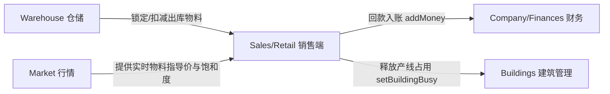

# SimCompanies Sales Buildings Semantic Analysis Report

本报告系统性回答关于 SimCompanies 销售与零售建筑的 11 项核心问题。

---

### 1. 一共发现多少个销售相关建筑？
**共发现 12 个销售相关建筑**：
* 8 个常规销售建筑（`category: "sales"`）
* 4 个季节性零售集市（`category: "seasonal"`，在对应季节开放零售商品出售）

---

### 2. 它们分别是什么？与 3. 每个 building type / ID 是什么？

| 建筑序号 | 建筑名称 (Display Name) | 内部代号 (dbLetter) | 建筑分类 (Category) | 授权销售商品范围 (Sellable Resources) |
| :---: | :--- | :---: | :---: | :--- |
| 1 | **杂货店 (Grocery Store)** | `G` | sales | 苹果、橙子、葡萄、牛排、香肠、鸡蛋、面粉等食品（IDs: 3, 4, 5, 7, 8, 9, 119, 122-127, 140, 152） |
| 2 | **电子产品商店 (Electronics Store)**| `C` | sales | 平板电脑、智能手机、笔记本、电视、显示器（IDs: 11, 12, 24-28, 98） |
| 3 | **加油站 (Gas Station)** | `A` | sales | 汽油 (Petrol, 11)、柴油 (Diesel, 12) |
| 4 | **服装店 (Fashion Store)** | `H` | sales | 内衣、手套、手袋、运动鞋、高档手表（IDs: 60-65, 70, 71） |
| 5 | **五金店 (Hardware Store)** | `d` | sales | 砖块、水泥、木板、窗户、工具（IDs: 91, 94-97, 99） |
| 6 | **汽车经销店 (Car Dealership)** | `2` | sales | 经济型轿车、豪华轿车、电动车、卡车（IDs: 53-57） |
| 7 | **销售办公室 (Sales Offices)** | `B` | sales | 航空火箭、卫星、民航客机等高阶直销合同 |
| 8 | **餐厅 (Restaurant)** | `r` | sales | 汉堡、沙拉、披萨、咖啡、各类菜品套餐（IDs: 117, 119, 121-126, 129-134, 142, 143, 149） |
| 9 | **秋季/万圣节集市 (Halloween Shop)** | `t` | seasonal | 南瓜汤、万圣节糖果、面具（IDs: 146-148） |
| 10| **夏季/沙滩集市 (Summer Shop)** | `z` | seasonal | 巧克力冰淇淋、苹果冰淇淋（IDs: 153, 154） |
| 11| **春季/复活节集市 (Easter Shop)** | `I` | seasonal | 复活节彩蛋（IDs: 151, 155） |
| 12| **圣诞集市 (Xmas Market)** | `u` | seasonal | 圣诞拉炮、圣诞毛衣、圣诞树（IDs: 67, 144, 150） |

---

### 4. 哪些共用 frontend logic？
**10 个建筑共用通用零售队列逻辑（`GenericRetailBuilding`）**：
* 包含：杂货店 (`G`)、电子商店 (`C`)、加油站 (`A`)、服装店 (`H`)、五金店 (`d`)、汽车经销店 (`2`) 以及 4 个季节集市 (`t`, `z`, `I`, `u`)。
* **共用交互模式**：
  * 进入建筑后共享同一个排产卡片视图。
  * 根据自身 `dbLetter` 从映射表 `dpr`（即 `RETAIL_BUILDING_RESOURCES`）过滤出允许在本建筑销售的物料下拉列表。
  * 销售行为被抽象为一种“排产任务”推入该建筑的 `queue` 队列。

---

### 5. 哪些有特殊 logic？
**存在 2 个具备完全专属业务逻辑的建筑**：
1. **销售办公室 (`Sales Offices`, dbLetter: `B`)**：
   * **非队列机制**：不使用排产队列，而是基于客户合同系统。
   * **寻客机制**：发起客户寻访（带倒计时），随机生成航空订单需求。
   * **履约机制**：支持勾选 `lowestQualityFirst: boolean`（优先消耗仓库中低品质物料）。
   * **拒绝/重置**：可主动拒绝订单释放位点，支持 SimBoosts 加速寻客。
2. **餐厅 (`Restaurant`, dbLetter: `r`)**：
   * **复合属性管理**：管理菜单品质、服务员人手配置（`staffLevel`）、座位容量（`seatingCapacity`）。
   * **排班轮次机制**：通过 `restaurant-runs` 管理营业班次（开放/关闭经营），每一轮结算营业额、原料消耗成本、净利润、就餐人数以及餐厅星级评分变动（`ratingDelta`）。

---

### 6. 每个建筑调用哪些 API？

* **通用零售 10 建筑**：
  * `GET /api/v2/companies/buildings/:id/queue/`
  * `POST /api/v2/companies/buildings/:id/queue/`
  * `DELETE /api/v2/companies/buildings/:id/queue/:taskId/`
  * `GET /api/v4/:realm/resources-retail-info/`（获取市场饱和度以计算预估销售时长）
* **销售办公室 (`B`)**：
  * `GET /api/v2/companies/buildings/:id/sales-orders/`
  * `POST /api/v2/companies/buildings/:id/sales-orders/`
  * `PUT /api/v2/companies/buildings/:id/sales-orders/:orderId/`
  * `DELETE /api/v2/companies/buildings/:id/sales-orders/:orderId/`
  * `POST /api/v1/rush/:token/`
* **餐厅 (`r`)**：
  * `GET /api/v2/companies/buildings/:id/restaurant-properties/`
  * `POST /api/v2/companies/buildings/:id/restaurant-properties/`
  * `GET /api/v2/companies/buildings/:id/restaurant-runs/`
  * `POST /api/v2/companies/buildings/:id/restaurant-runs/`

---

### 7. 每个 API 返回哪些被实际使用的字段？

1. **通用零售队列 `POST /queue/` & `GET /queue/`**：
   * `id`: 任务主键 ID
   * `buildingId`: 归属建筑 ID
   * `resourceId`: 销售的商品 ID
   * `amount`: 待售件数
   * `price`: 单件零售售价
   * `quality`: 出售商品的品质要求
   * `busyUntil`: 销售结束时间戳（驱动前端进度条倒计时）
2. **销售办公室合同交付 `PUT /sales-orders/:id/`**：
   * `money`: 履约成功收到的结算货款（触发 `addMoney`）
   * `resourceTransactions`: 扣除的物料清单（数组结构：`dbLetter`, `quality`, `amount`）
3. **餐厅班次结算 `POST /restaurant-runs/`**：
   * `revenue`: 本轮总营业额
   * `cost`: 食材与人力成本
   * `profit`: 净利润
   * `customersServed`: 就餐顾客总数
   * `ratingDelta`: 餐厅评级变动增量

---

### 8. 销售端与其它核心子系统的连接

* **与仓储 (`warehouse`)**：启动销售或交付订单时，前端立即触发 Redux 物料扣减；取消销售时原料返还。
* **与市场 (`market`)**：零售时长受全服饱和度 `saturation` 弹性调节；偏离最优零售价会导致二次价格惩罚。
* **与财务 (`finances`)**：销售回款直接进入公司流动现金资产；利润表记录营业收入与销货成本。
* **与建筑管理 (`buildings`)**：销售建筑等级 `size` 线性增加餐厅座位数，或按比例提升通用零售吞吐时产。

---

### 9. 哪些 API Phantom 后端已实现？
* ✅ `GET/POST/DELETE /api/v2/companies/buildings/:id/queue/`
* ✅ `GET/POST/PUT/DELETE /api/v2/companies/buildings/:id/sales-orders/`
* ✅ `GET/POST /api/v2/companies/buildings/:id/restaurant-properties/`
* ✅ `GET/POST /api/v2/companies/buildings/:id/restaurant-runs/`
* ✅ `GET /api/v4/:realm/resources-retail-info/`
* ✅ `GET /api/v3/market-ticker/:realm/`

---

### 10. 哪些 API Phantom 尚缺失或 schema 不完整？
* ⚠️ `POST /api/v1/rush/:token/`：SimBoosts 加速寻客端点入参在部分测试中存在 UUID token 与纯数字 buildingId 传参兼容性要求。
* ⚠️ 餐厅评分更新机制：`ratingDelta` 在多并发结算时需保证与高管技能严格联动。

---

### 11. 证据置信度判定
* **100% 确定事实 (Facts, 1.0)**：12 个销售建筑分类、代号、授权销售品类列表、销售办公室与餐厅 API 端点路径、Redux 状态消费逻辑。
* **高置信度推导 (Strong Inferences, 0.90-0.95)**：季节建筑在淡季关闭时的 UI 渲染条件判断（饱和度低于 0.8 抑制排产）。
